# 前端渲染链

## 0. 术语

- **基座**：`live.js` 中创建共享状态、载入实时数据并首次定义页面渲染函数的代码。
- **包装层**：保存已有全局函数后再赋予同名函数的脚本代码；它可在未拆分的局部行为中出现，但不再承担页面 render 的组合职责。
- **render 扩展**：live.js 提供有序注册入口；实时状态、项目页、偏好状态和阅读回顾按脚本加载顺序登记，并在基座 render 完成后执行。
- **扩展注册**：模块提供命名注册函数，其他模块登记行为，由拥有者在稳定阶段调用；render、规则通知、详情增强和项目图表均使用这一方式。
- **脚本顺序契约**：`index.html` 中的 `<script>` 顺序。由于脚本不使用模块导入，后加载文件能够访问并覆盖前一文件定义的全局符号。

## 1. 定位与受众

这一层负责把服务器采集的项目、行情、新闻和规则数据呈现为收件箱、项目页、详情弹窗和规则页。它面向修改页面行为的 feature-design、定位前端回归的 issue-analyze，以及需要理解加载顺序的新维护者。

文档的目标是说明“哪个脚本拥有基础状态、哪个脚本追加哪一段 UI、顺序为何不能随意调整”，以便在不改变行为的前提下拆分后续模块级重构。

## 2. 结构与交互

所有前端脚本在同一浏览器全局作用域中按以下顺序执行。脚本顺序决定注册是否可用，也定义 render 扩展的执行顺序；页面 render、规则通知、详情增强和项目图表均不再通过同名全局函数覆盖组合。代码没有 ES module 的导入边界。

```mermaid
flowchart LR
  Index["index.html"] --> Source["source-status.js"]
  Source --> Live["live.js: state + base UI"]
  Live --> Project["project.js: project/detail/card/add"]
  Project --> Rules["rules.js: server rules UI"]
  Rules --> Reorder["reorder.js"]
  Reorder --> Watchlist["watchlist.js"]
  Watchlist --> Charts["charts.js: linked chart"]
  Charts --> Notifications["notifications.js"]
  Notifications --> Preferences["preferences.js"]
  Preferences --> Reading["reading-updates.js"]
```

| 全局接线缝 | 基座与后续覆盖 | 当前职责 |
| --- | --- | --- |
| `render` | `live.js` 的 `registerRenderExtension`；依次登记实时状态、项目页、偏好状态与阅读回顾；`charts.js` 注册项目页扩展 | 基座先绘制收件箱和项目占位，再按固定顺序补充实时状态、项目页、footer 状态和阅读回顾。 |
| `openDetail` | `live.js` 的 `registerDetailExtension`；`project.js` 与 `reading-updates.js` 注册扩展 | 基座详情先运行阅读的 `beforeOpen` 版本记录，写入详情骨架后按顺序追加质量解释、项目本地化、关联报道和阅读时间线。 |
| `eventCard` | `live.js` → `project.js` → `reading-updates.js` | 基座事件卡，再追加翻译/原文切换、归并标签、进展候选和已读事件的新进展提示。 |
| `renderRules` / `openRule` | `live.js` → `rules.js`；`notifications.js` 注册规则页扩展 | 以服务器规则和触发记录替代原型规则 UI；规则页在基础内容完成后显式插入浏览器通知控制面板。 |
| 项目页 | `project.js` 的 `registerProjectPageExtension`；`charts.js` 注册关联图表 | 项目页先写入项目概览并压缩账户卡，再由图表控制器替换首个行情区块并确保对应图表数据。 |
| `filteredEvents` | `live.js` → `reading-updates.js` | 先按来源和时间窗口过滤，再在“只看更新”模式下筛选阅读回顾项。 |

`watchlist.js` 覆盖 `renderProjectList` 以提供分组、置顶与拖动排序。关联图表由 `charts.js` 的控制器注册到项目页扩展入口，并在首个行情 `.project-section` 存在时替换它。

**代码锚点**：脚本顺序见 `dist/index.html:5`；render 与详情注册见 `dist/live.js`；项目页注册见 `dist/project.js`；偏好状态与阅读回顾分别在 `dist/preferences.js`、`dist/reading-updates.js` 登记为 render 扩展；规则、图表与通知继续各自使用命名入口。

## 3. 数据与状态

`live.js` 持有可变的共享 UI 状态：`state` 包含当前项目、视图、筛选、收藏、已读和关注列表；`events` 保存从实时接口规范化后的事件；`liveData` 保存最近一次服务端载荷。所有包装层直接读取或修改这些变量，而不是通过独立接口通信。

| 状态域 | 所有者与写入路径 | 持久化边界 |
| --- | --- | --- |
| 视图、筛选、项目、收藏、已读和关注列表 | `live.js` 初始化；点击处理、watchlist、project、preferences 和 reading-updates 可更新 | 初始写入 `localStorage` 的 `signal-live-v1`；preferences 层再与 `/api/preferences` 同步。 |
| 实时采集数据与标准化事件 | `refreshLive` 更新 `liveData` 和 `events` | 内存；由 `/api/live` 刷新。 |
| 图表缓存与图表设置 | `charts.js` 的关联图表控制器 | 内存。控制器对外暴露当前设置、请求、呈现和新闻入口。 |
| 阅读进度与事件版本 | `reading-updates.js` 的 `versions` 和 `ledger` | `localStorage` 的 `signal-reading-v2`。 |
| 浏览器通知授权和已见提醒 | `notifications.js` | `localStorage` 的 `signal-browser-notifications-v1`；通知权限仍属于浏览器。 |

偏好同步在本机变更后保留进行中的编辑，并在服务端冲突时加载服务端版本；它仍包装 persist，但通过 renderPreferenceStatus 扩展更新 footer 文案。阅读层在详情打开时记录版本，并由 renderReadingPage 扩展判断已读事件的新进展、插入 catchup 和提醒回看内容。

**代码锚点**：`dist/live.js:4-11`、`dist/preferences.js:3-58`、`dist/charts.js:1-32`、`dist/reading-updates.js:2-16,30-44`、`dist/notifications.js:6-55`。

## 4. 关键决策

- [explicit-ui-composition](../compound/2026-09-28-decision-explicit-ui-composition.md)：新增或拆分 UI 行为使用模块拥有的命名组合入口，不新增依赖同名全局函数覆盖的组合。

## 5. 代码锚点

- `dist/index.html:5` — 前端脚本的唯一加载顺序。
- `dist/live.js:1-77` — 共享状态、基座 UI、详情扩展阶段、实时数据处理和质量/来源筛选叠加。
- `dist/project.js:3-21,67` — 项目页、事件卡、详情本地化、关联报道和项目页扩展入口。
- `dist/rules.js:3-10` — 服务端规则页、规则页扩展入口和规则表单。
- `dist/charts.js:1-32` — 关联图表控制器、项目页注册和图表交互。
- `dist/preferences.js` — 偏好同步的 persist 包装与 footer 状态 render 扩展。
- `dist/reading-updates.js:8-73` — 阅读 ledger、详情控制器、回顾面板和详情时间线。
- `test_render_chain.cjs:1`、`test_detail_chain.cjs:1`、`test_rules_ui.cjs:1`、`test_project_ui.cjs:1` — 当前组合行为的刻画测试。

## 6. 已知约束 / 边界情况

- 改动脚本顺序、删改注册函数或扩展名称时，必须同时审查后续注册方；注册依赖仍受加载顺序约束。
- 新的规则通知、详情或项目图表行为必须通过各自的命名扩展入口接入；不得新增同名 `render`、`openDetail` 或 `renderRules` 覆盖。
- 新的页面 render 行为必须登记到 registerRenderExtension；不得通过保存旧 render 后重赋同名函数来接入。
- 渲染链在加载期会执行多次，preferences 异步同步完成后还会再次渲染；刻画测试在断言前应等待异步任务稳定。
- browser notification 只在安全上下文、具备 `navigator.locks` 且页面保持打开时工作；它不是后台推送。

## 7. 相关文档

- `.codestable/refactors/2026-09-28-render-chain/2026-09-28-render-chain-handoff.md` — 渲染链 refactor 的刻画测试结果与下一步边界。
- `.codestable/refactors/2026-09-28-rules-notifications/` — 已完成的规则通知显式组合 refactor。
- `.codestable/refactors/2026-09-28-detail-reading/` — 已完成的详情与阅读显式组合 refactor。
- `.codestable/refactors/2026-09-28-project-charts/` — 已完成的项目图表显式组合 refactor。
- `.codestable/audits/2026-09-28-project-wide/finding-07.md` — 本次 refactor 的审计来源。

## 变更日志

- 2026-09-28：rules-notifications、detail-reading、project-charts 与 render-orchestration 全部迁移为命名组合入口；render 扩展顺序由刻画测试锁定。
